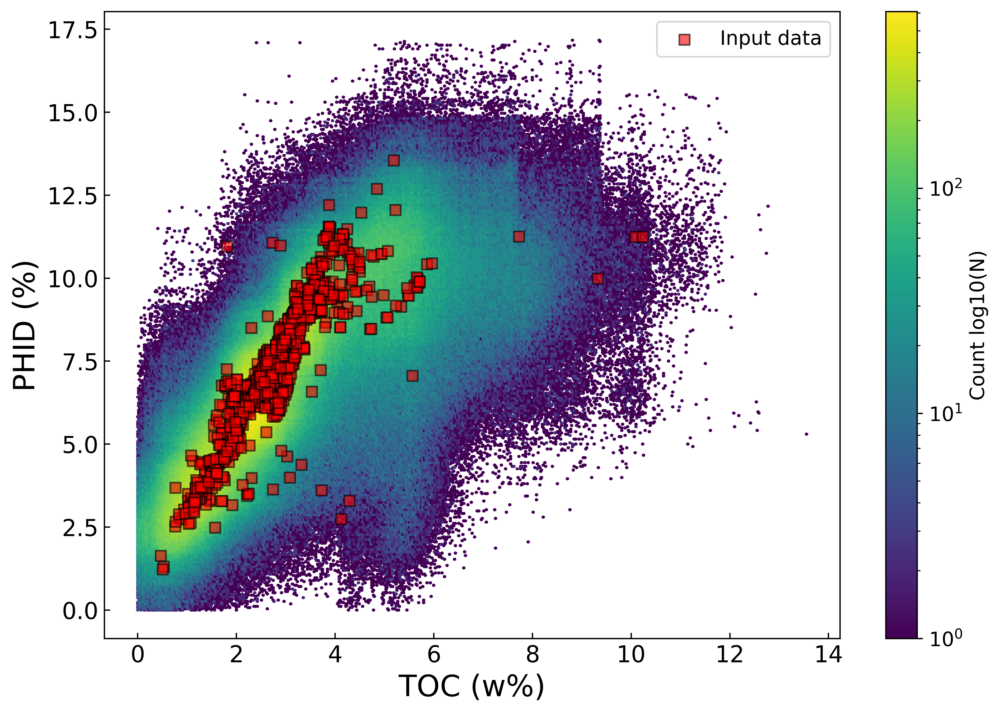

# Spatial Data Analytics-Assisted Subsurface Modeling

The presence of geological trends, spatial autocorrelation, and data paucity pose a challenge to analyzing subsurface datasets with standard data analysis tools. Therefore, this repository details how to efficiently combine data analytics, geostatistics, and optimization techniques to analyze 2D geophysical datasets.
## Documentation

The proposed workflow was used to model total organic carbon (TOC) using density-porosity (PHID) as secondary feature using 1,152 wells from the Duvernay Formatio, in Canada. Let's take a look to the scatter plot between the primary and secondary features.

If you only use machine learning, you will have problems replicating the spatial continuity and satisfying the independent and identically distributed (i.i.d.) data assumption.

Given that all realizations are equiprobable, it is feasible to assess the uncertainty of the results. The next figure shows the probability of exceeding 7.5% for all realizations of density porosity.

The next figure shows a hexagonal binning scatterplot that compares all the realizations of primary and secondary features with the input data. The PHID feature lacks a lithology – TOC effect correction; therefore, the positive linear relationship between porosity with TOC is expected, and the proposed workflow replicates that relationship.

## 

This is the code to replicate the results from the [scientific publication](https://onepetro.org/petrophysics/article/64/02/287/518750/Spatial-Data-Analytics-Assisted-Subsurface):

Salazar, J. J., Ochoa, J., Garland, L., Lake, L.W., and Pyrcz, M. J. (2023). Spatial Data Analytics-Assisted Subsurface Modeling: A Duvernay Case Study. Petrophysics, 64(2). doi:10.30632/PJV64N2-2023a9.

## Acknowledgements
 - Appreciation to coauthors Jesus Ochoa, Lean Garland, and Michael J. Pyrcz.
 - [Awesome Readme Templates](https://awesomeopensource.com/project/elangosundar/awesome-README-templates)

**DISCLAIMER**

The information included on this site is for educational purposes only. Neither The University of Texas at Austin nor the authors provide a warranty expressed or implied in its application.

Nothing described within this script should be construed to lessen the need to apply sound engineering judgment or carefully use accepted engineering practices to design, implement, or apply the techniques described herein.